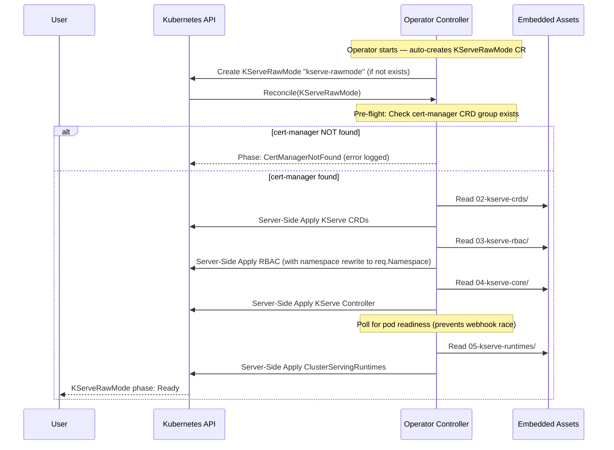

# KServe Operator Packaging Architecture

This project automates the extraction, packaging, and deployment of KServe in **Raw Deployment Mode** (without Istio/Knative dependencies). It consists of two main pipelines: extracting the manifests and wrapping them into a standalone Kubernetes Operator.

## 1. High-Level Architecture Flow

```mermaid
flowchart TD
    classDef script fill:#f9f,stroke:#333,stroke-width:2px;
    classDef package fill:#bbf,stroke:#333,stroke-width:1px;
    classDef k8s fill:#dfd,stroke:#333,stroke-width:1px;
    classDef prereq fill:#ffd,stroke:#888,stroke-width:1px,stroke-dasharray:5;

    Source[("kserve-master\n(Upstream Repo)")] --> ExtractScript

    subgraph Phase1["Phase 1 — generate-kserve-raw.sh"]
        ExtractScript[["generate-kserve-raw.sh\n-t p-kserve-raw"]]:::script
        RawPkg["Raw Manifest Package\n(p-kserve-raw/)\n02-kserve-crds\n03-kserve-rbac\n04-kserve-core ← RawDeployment patched\n05-kserve-runtimes\n06-sample-model\n(numbering starts at 02 —\ncert-manager is a cluster prereq,\nnot bundled)"]:::package
        ExtractScript -->|Extracts & Patches| RawPkg
    end

    RawPkg -->|Source input| OperScript

    subgraph Phase2["Phase 2 — generate-kserve-operator.sh"]
        OperScript[["generate-kserve-operator.sh\n-t p-kserve-operator -s p-kserve-raw\n-i <registry>/<image>:<tag>\n--install-mode SingleNamespace\n-b -p -o"]]:::script
        OperProj["Go Operator Project\n(p-kserve-operator/)"]:::package
        DockerImg["Container Image\n<registry>/<image>:<tag>\n(host arch by default;\nuse --multi-platform for amd64+arm64)"]:::package
        StandalonePkg["Standalone Package\n(p-kserve-operator-package/)\noperator-deployment.yaml\nkserve-rawmode.yaml (sample CR)\nREADME.md\nsetup-credentials.sh\n06-sample-model/\n[mirror-images.sh]  ← only with --customer-registry\n[deploy-bundle.sh]  ← only with --customer-registry"]:::package
        OLMPkg["OLM Bundle Image\n<registry>/<image>:<tag>-bundle"]:::package

        OperScript -->|operator-sdk scaffold| OperProj
        RawPkg -..->|Embedded into assets/| OperProj
        OperProj -->|docker build + push| DockerImg
        OperProj -->|kustomize build| StandalonePkg
        OperProj -->|make bundle + push| OLMPkg
    end

    subgraph CustomerReg["Customer Registry (optional — --customer-registry flag)"]
        MirrorOnline["mirror-images.sh (online)\nskopeo copy src → customer registry"]:::script
        MirrorArchive["mirror-images.sh --archive\nskopeo save → images/*.tar"]:::script
        MirrorLoad["mirror-images.sh --load\nskopeo copy tar → customer registry"]:::script
        MirrorArchive -->|Transfer archives| MirrorLoad
    end

    StandalonePkg -.->|if --customer-registry| MirrorOnline
    StandalonePkg -.->|if --customer-registry| MirrorArchive

    subgraph Deploy["Deployment Options"]
        OLM["OLM pre-installed\noperator-sdk olm install"]:::prereq
        CertMgr["cert-manager pre-installed\n(cluster prerequisite — kubectl apply -f cert-manager.yaml)"]:::prereq
        Creds["setup-credentials.sh\n(only if image is private)"]:::script
        OLM -->|prerequisite| OLMPkg
        CertMgr -->|prerequisite| OLMPkg
        Creds -->|pull secret ready| OLMPkg
        OLMPkg -->|operator-sdk run bundle\n--install-mode SingleNamespace=kserve\n(or deploy-bundle.sh with --customer-registry)| K8sCluster
        StandalonePkg -->|kubectl apply\n(direct manifest path)| K8sCluster
    end

    MirrorOnline -->|customer registry images ready| Creds
    MirrorLoad -->|customer registry images ready| Creds

    subgraph K8s["Target Kubernetes Cluster"]
        K8sCluster[("Kubernetes Cluster")]:::k8s
        OperPod["Operator Controller Pod\n(pulls via pull secret)"]:::k8s
        AutoCR["Auto-Init: Operator creates\nKServeRawMode CR automatically\non first startup"]:::k8s
        KServeStack["Active KServe Stack\nKServe CRDs + RBAC\nKServe Controller + ServingRuntimes\n(cert-manager is a cluster pre-requisite,\nnot deployed by the operator)"]:::k8s
        IFSvc["InferenceService\nsklearn-iris predictor"]:::k8s

        K8sCluster --> OperPod
        OperPod -->|Creates on startup| AutoCR
        AutoCR -->|Triggers reconcile| KServeStack
        KServeStack -->|Ready for| IFSvc
    end
```

## 2. Operator Reconciliation Loop (Internal)

Once the operator starts, it **automatically creates** a `KServeRawMode` CR and runs the following sequential reconciliation loop:



> No manual `kubectl apply -f kserve-rawmode.yaml` is required. The operator auto-initialises KServe on startup.

## 3. End-to-End Test Validation Summary

The following was verified in a live test on a fresh Docker Desktop Kubernetes cluster, covering both the default-namespace path and a custom-namespace install (Design C):

### Phase 1 — Default `kserve` namespace

| Step | Command | Result |
|------|---------|--------|
| Pre-flight | (cert-manager + OLM installed once per cluster) | ✅ |
| Extract manifests | `./generate-kserve-raw.sh -t p-kserve-raw` | ✅ 4 manifest dirs (02–05) + 06-sample-model |
| Generate operator | `./generate-kserve-operator.sh ... -b -p -o` | ✅ Operator project + OLM bundle built and pushed |
| Create namespaces | `kubectl create namespace kserve` + `kserve-operator-system` | ✅ |
| Deploy bundle | `operator-sdk run bundle <bundle-image> --namespace kserve-operator-system --install-mode SingleNamespace=kserve` | ✅ CSV Phase: Succeeded; OperatorGroup auto-created |
| Watch KServe install | `kubectl get kserverawmode -A -w` | ✅ CR auto-created in `kserve`; Phase: Ready in ~44s |
| Test inference | `curl .../sklearn-iris:predict` | ✅ `{"predictions":[1]}` |

### Phase 2 — Custom `my-kserve` namespace

| Step | Command | Result |
|------|---------|--------|
| Create namespaces | `kubectl create namespace my-kserve` + `kserve-operator-system` | ✅ |
| Deploy bundle | `operator-sdk run bundle <bundle-image> --namespace kserve-operator-system --install-mode SingleNamespace=my-kserve` | ✅ |
| CR auto-created in `my-kserve`; KServe runtime installed in `my-kserve` (apply-time YAML rewrite) | `kubectl get kserverawmode -A` | ✅ Ready in ~40s |
| All baked `kserve` refs rewritten | RoleBinding subjects, WebhookConfiguration `service.namespace`, Certificate `dnsNames`, `cert-manager.io/inject-ca-from` annotation | ✅ all → `my-kserve` |
| Test inference | `curl .../sklearn-iris:predict` | ✅ `{"predictions":[1]}` |

### Cleanup

| Step | Command |
|------|---------|
| Tear down operator | `operator-sdk cleanup p-kserve-operator -n kserve-operator-system` |
| Remove namespaces | `kubectl delete ns my-kserve kserve-operator-system` |
| Clean generated dirs | `./generate-kserve-operator.sh -c p-kserve-operator` |
