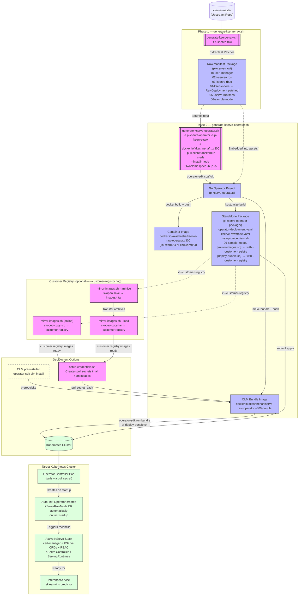
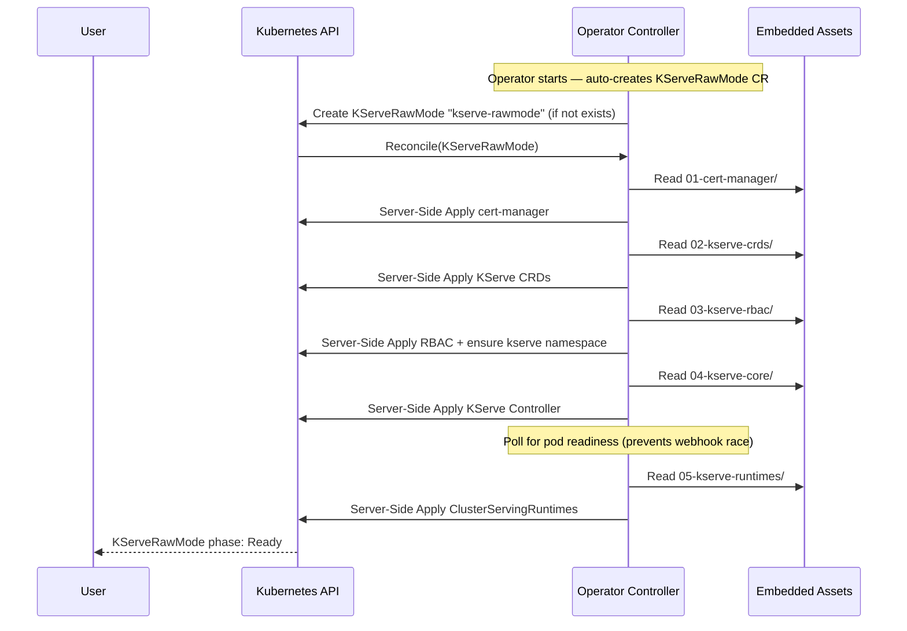

# KServe Operator Packaging Architecture

This project automates the extraction, packaging, and deployment of KServe in **Raw Deployment Mode** (without Istio/Knative dependencies). It consists of two main pipelines: extracting the manifests and wrapping them into a standalone Kubernetes Operator.

## 1. High-Level Architecture Flow

## 2. Operator Reconciliation Loop (Internal)

Once the operator starts, it **automatically creates** a `KServeRawMode` CR and runs the following sequential reconciliation loop:

> No manual `kubectl apply -f kserve-rawmode.yaml` is required. The operator auto-initialises KServe on startup.

## 3. End-to-End Test Validation Summary

The following was verified in a live test on a fresh Docker Desktop Kubernetes cluster (both standard and customer-registry archive flows):

| Step | Command | Result |
|------|---------|--------|
| Extract manifests | `./generate-kserve-raw.sh -t p-kserve-raw` | ✅ All 5 manifest dirs created |
| Generate operator | `./generate-kserve-operator.sh ... -b -p -o` | ✅ Operator project + OLM bundle built and pushed |
| Archive images (customer) | `bash mirror-images.sh --archive` | ✅ images/operator.tar + images/bundle.tar created |
| Load images (customer) | `bash mirror-images.sh --load --user ... --pass ...` | ✅ Images pushed to customer registry |
| Install OLM | `operator-sdk olm install` | ✅ v0.28.0 installed, all pods Running |
| Set up credentials | `bash setup-credentials.sh --user ... --pass ...` | ✅ Pull secret created in default/olm/operators |
| Deploy bundle | `bash deploy-bundle.sh` | ✅ CSV Phase: Succeeded |
| Watch KServe install | `kubectl get kserverawmode -A -w` | ✅ Phase: Ready (~60s), no manual CR apply needed |
| Test inference | `curl .../sklearn-iris:predict` | ✅ `{"predictions":[1]}` |
| Cleanup | `./generate-kserve-operator.sh -c p-kserve-operator` | ✅ Workspace restored |
