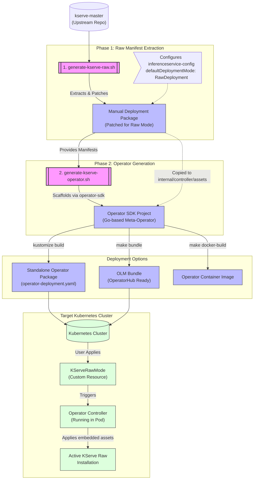
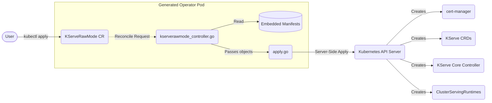

# KServe Operator Packaging Architecture

This project automates the extraction, packaging, and deployment of KServe in **Raw Deployment Mode** (without Istio/Knative dependencies). It consists of two main pipelines: extracting the manifests and wrapping them into a standalone Kubernetes Operator.

## 1. High-Level Architecture Flow

## 2. Generated Operator Internal Execution

The resulting generated Go Operator has the following internal structure to reconcile the KServe installation:

