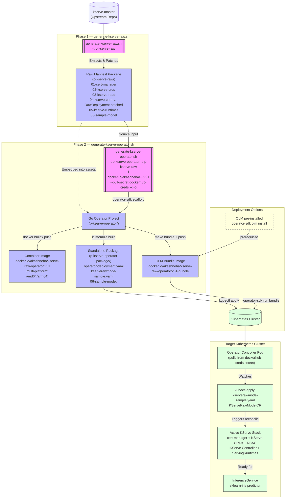
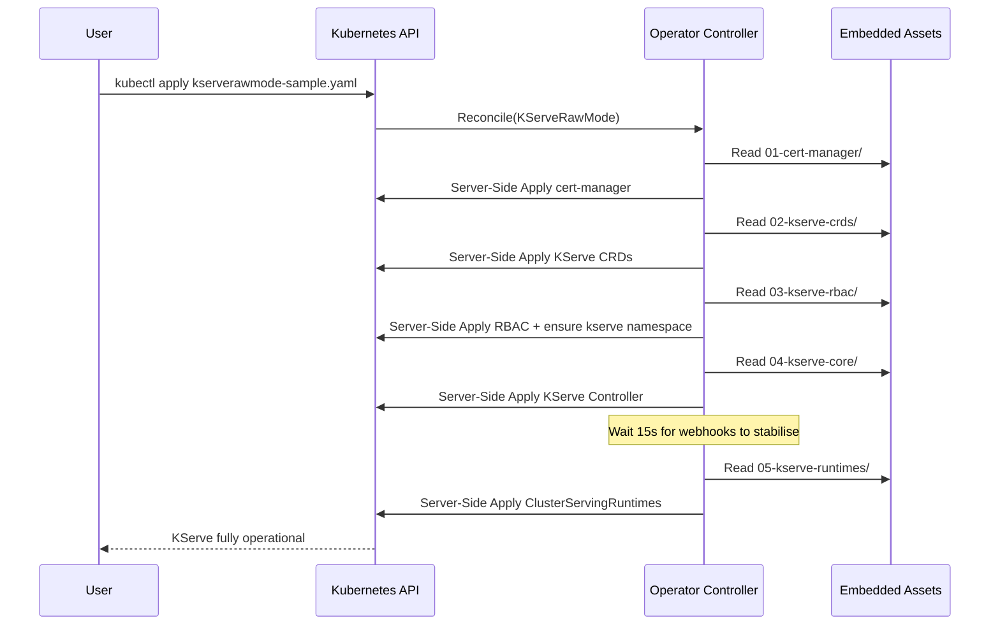

# KServe Operator Packaging Architecture

This project automates the extraction, packaging, and deployment of KServe in **Raw Deployment Mode** (without Istio/Knative dependencies). It consists of two main pipelines: extracting the manifests and wrapping them into a standalone Kubernetes Operator.

## 1. High-Level Architecture Flow

## 2. Operator Reconciliation Loop (Internal)

Once the `KServeRawMode` CR is applied, the operator runs the following sequential reconciliation loop:

## 3. End-to-End Test Validation Summary

The following was verified in a live test on a fresh Docker Desktop Kubernetes cluster:

| Step | Command | Result |
|------|---------|--------|
| Extract manifests | `./generate-kserve-raw.sh -t p-kserve-raw` | ✅ All 5 manifest dirs created |
| Generate operator | `./generate-kserve-operator.sh ... -x -o` | ✅ Operator project + OLM bundle built |
| Install OLM | `operator-sdk olm install` | ✅ v0.28.0 installed |
| Deploy bundle | `operator-sdk run bundle ...v51-bundle` | ✅ CSV Phase: Succeeded |
| Apply CR | `kubectl apply -f ...kserverawmode-sample.yaml` | ✅ KServe 2/2 Running |
| Test inference | `curl .../sklearn-iris:predict` | ✅ `{"predictions":[1,1]}` |
| Cleanup | `./generate-kserve-operator.sh -c p-kserve-operator` | ✅ Workspace restored |
