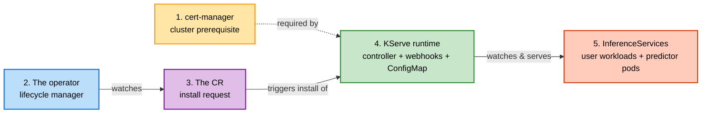
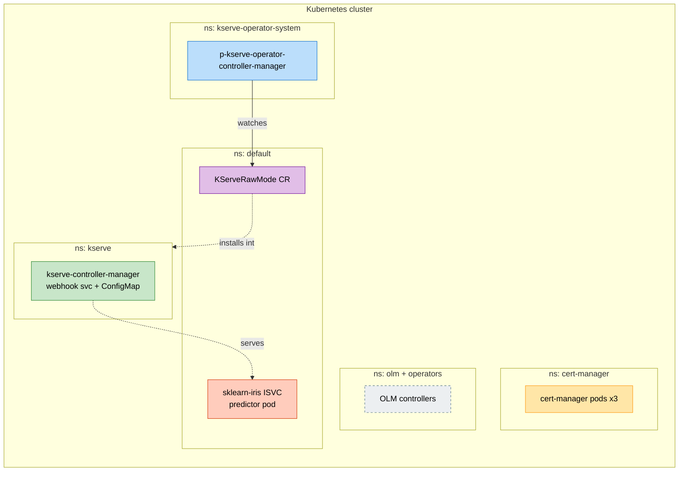
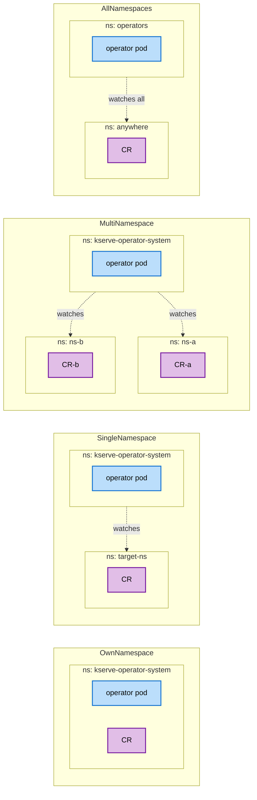
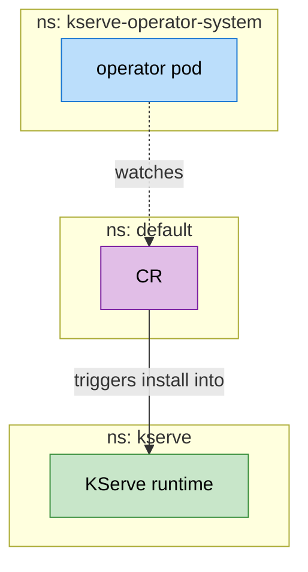
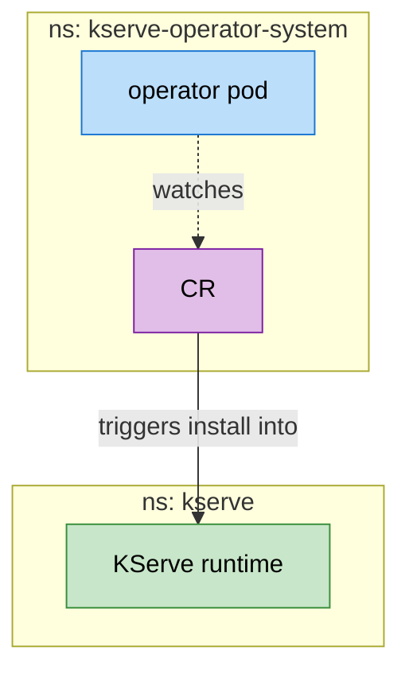
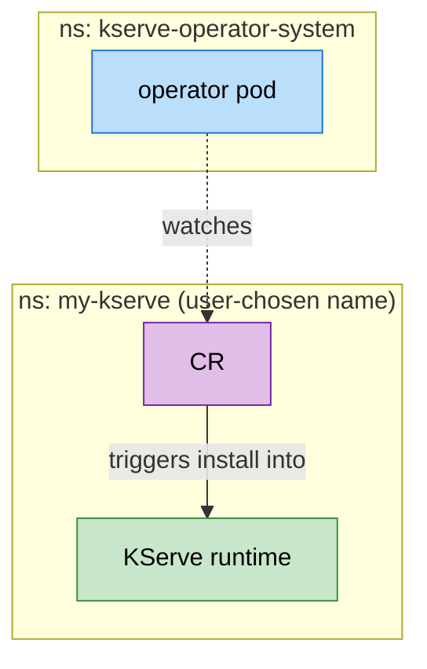

# KServe Operator — Namespace & Install-Mode Design

This document explains how Kubernetes namespaces and OLM install modes interact in the KServe Raw Mode operator, what the current design looks like, what the alternatives are, and which design we recommend going forward.

It is meant to be read top-to-bottom by someone who hasn't worked on this project — review it with your team before we commit to a final design.

---

## 1. Why this matters

Several distinct things have to live somewhere on a cluster when you install KServe via this operator:

- **The operator itself** (the controller pod that manages KServe's lifecycle)
- **The CR** that asks the operator to install KServe (`KServeRawMode`)
- **KServe's own runtime** (its controller-manager, webhooks, ConfigMap)
- **The InferenceServices users deploy** (and the predictor pods they spawn)
- **cert-manager** (a cluster prerequisite)

If you put these in the wrong namespaces — or collapse roles that should stay separate — you get fragile RBAC, awkward upgrade paths, multi-tenancy blockers, and confusing `kubectl get` output. Picking the right shape now saves rework later.

---

## 2. The five conceptual roles



| # | Role | Lifecycle | Who owns it |
|---|------|-----------|-------------|
| 1 | cert-manager | Independent — installed before the operator, never managed by it | Cluster admin |
| 2 | Operator pod | Installed via OLM bundle or direct kubectl | Cluster admin |
| 3 | KServeRawMode CR | One per cluster (singleton); created automatically by the operator at startup | Operator |
| 4 | KServe runtime | Created/destroyed by the operator in response to the CR | Operator |
| 5 | InferenceServices | Created by end users in any namespace they want | End users |

Roles 2, 3, 4 and 5 each have a different lifecycle, RBAC profile, and blast radius — that's why they tend to live in different namespaces.

---

## 3. What's deployed today (current design)



Four namespaces are in play (excluding cert-manager and OLM infra):

| Namespace | What lives here | Notes |
|-----------|-----------------|-------|
| `kserve-operator-system` | Operator pod | Created by user before deploy |
| `default` | CR + sample InferenceService | The CR landed here because the OperatorGroup targets `default` |
| `kserve` | KServe runtime (controller, webhook svc, ConfigMap) | Created by user as a prereq |
| `<wherever>` | Real-world InferenceServices | User chooses |

**The CR ending up in `default` is a side effect of how the OperatorGroup is configured today** (`SingleNamespace` install mode targeting `default`). It's not particularly intentional and pollutes a namespace users typically use for ad-hoc work.

---

## 4. OLM install modes — primer

Every operator installed via OLM has an **OperatorGroup**. The OperatorGroup defines which namespace(s) the operator's CRs are watched in. The CSV declares which **install modes** (i.e. which OperatorGroup geometries) it supports. There are four modes.



| Mode | OperatorGroup `targetNamespaces` | Where the CR lives | Typical use case |
|------|----------------------------------|---------------------|------------------|
| **OwnNamespace** | `[<operator-ns>]` | Same namespace as the operator pod | Singleton operators that manage themselves |
| **SingleNamespace** | `[<exactly one other ns>]` | That one other namespace | Operator pod runs centrally, CRs live in a tenant namespace |
| **MultiNamespace** | `[ns-a, ns-b, ...]` | Any of the listed namespaces | One operator instance serving multiple specific tenants |
| **AllNamespaces** | `[]` (empty = all) | Anywhere on the cluster | Cluster-wide operators (operator pod is forced into the OLM `operators` namespace) |

### The key thing to internalize

**Install mode is not about RBAC scope** (the operator's cluster-scoped permissions come from its CSV regardless of mode). It's about **where the CR lives** relative to where the operator pod runs.

For a singleton like ours — one KServe install per cluster — `MultiNamespace` and `AllNamespaces` are overkill. The interesting choice is between **OwnNamespace** and **SingleNamespace**.

---

## 5. Three viable designs for our operator

We've narrowed the choice to three shapes. All three keep the operator in a fixed namespace (`kserve-operator-system`) and let cert-manager + ISVCs live where they always lived.

### Design A — SingleNamespace targeting `default` (TODAY)



- Operator: `kserve-operator-system`
- CR: `default`
- KServe runtime: `kserve`
- **3 namespaces in our footprint.** CR pollutes the user-facing `default` namespace.

### Design B — OwnNamespace



- Operator + CR: `kserve-operator-system`
- KServe runtime: `kserve` (or whatever name we pick)
- **2 namespaces.** The CR is cleanly bundled with the operator.
- Standard OLM convention for singleton platform operators.

### Design C — SingleNamespace targeting the user's chosen KServe namespace



- Operator: `kserve-operator-system`
- CR + KServe runtime: **same namespace, name chosen by user** (defaults to `kserve`)
- **2 namespaces.** The CR sits next to the thing it manages.
- The user picks the namespace name **once** — when they create the namespace and the OperatorGroup. There's nothing else to configure.

---

## 6. Side-by-side comparison

| | Design A (current) | Design B (OwnNamespace) | Design C (user-chosen target) |
|---|---|---|---|
| Operator footprint | 3 namespaces | 2 namespaces | 2 namespaces |
| CR location | `default` (fixed) | Operator namespace (fixed) | User's chosen KServe namespace |
| KServe runtime location | `kserve` | `kserve` | User-chosen (`my-kserve`, etc.) |
| Source of truth for "where is KServe?" | Two places (`default` + `kserve`) | Two places (operator-system + `kserve`) | **One place** (the user's namespace) |
| User-friendly default flow | Awkward (CR in `default`) | Clean | Clean |
| Custom KServe namespace name | Hard (must coordinate two settings) | Possible (separate `spec.kserveNamespace` knob) | **Native** (just name the namespace what you want) |
| Uninstall | Two deletes | One delete (drop operator-system) | Two deletes (drop both namespaces) |
| Multi-tenant ISVCs | ✅ supported (independent of this choice) | ✅ supported | ✅ supported |
| Multi-tenant **KServe** installs | ❌ KServe is cluster-singleton — out of scope for all three | ❌ same | ❌ same |

---

## 7. Recommended design — Design C

### Why

- **One source of truth.** The user picks a namespace name once (when creating the namespace and the OperatorGroup). The CR's `metadata.namespace` IS the configuration — nothing else to set, no chance of mismatch.
- **No extra CRD knob.** We can drop `spec.kserveNamespace` entirely — the CR's own location tells the operator everything.
- **Locality.** A user troubleshooting the install runs `kubectl get all -n my-kserve` and sees the CR + KServe components together.
- **Defaults are easy.** A user who doesn't want to think about it just creates `kserve` and follows the unchanged copy-paste recipe.

### How the operator derives the target namespace

```
OperatorGroup.targetNamespaces = [my-kserve]
        │
        ▼
OLM injects WATCH_NAMESPACE=my-kserve into the operator pod
        │
        ▼
Manager configured to watch my-kserve for KServeRawMode CRs
        │
        ▼
auto-init creates CR in my-kserve
        │
        ▼
Reconcile sees req.Namespace == "my-kserve"
        │
        ▼
applyManifests(targetNS = "my-kserve")
        │
        ▼
apply.go rewrites every "namespace: kserve" reference in the
embedded KServe YAML → "my-kserve" before applying
```

### What the user-facing flow looks like

```bash
# 1. Pick whatever namespace name you want for KServe
kubectl create namespace my-kserve

# 2. Operator namespace (always the same)
kubectl create namespace kserve-operator-system

# 3. OperatorGroup targets the user's chosen ns
kubectl apply -f - <<EOF
apiVersion: operators.coreos.com/v1
kind: OperatorGroup
metadata:
  name: kserve-operator-og
  namespace: kserve-operator-system
spec:
  targetNamespaces:
    - my-kserve
EOF

# 4. Install
operator-sdk run bundle docker.io/.../v401-bundle --namespace kserve-operator-system
# → operator pod in kserve-operator-system
# → CR auto-created in my-kserve
# → KServe runtime installed in my-kserve
# → done
```

If the user accepts the default name, replace `my-kserve` with `kserve`. That's the only difference.

### What changes in the codebase

| File | Change |
|---|---|
| `kserve-operator-base/kserverawmode_types.go.tmpl` | Drop `KServeNamespace` field from CRD spec (or mark deprecated/ignored for back-compat) |
| `kserve-operator-base/kserverawmode_controller.go.tmpl` | Replace `resolveKServeNamespace()` with `req.Namespace`; auto-init reads `WATCH_NAMESPACE` |
| `kserve-operator-base/apply.go.tmpl` | Add `targetNS` parameter; rewrite `kserve` → `targetNS` on object namespaces, ClusterRoleBinding subjects, *WebhookConfiguration `clientConfig.service.namespace` |
| `kserve-raw-base/install.sh.tmpl` | Standalone manual-install path: accept `KSERVE_NAMESPACE` env var (default `kserve`), apply same YAML rewrites |
| `kserve-raw-base/README.md.tmpl` | Document the namespace knob in the standalone path |
| `generate-kserve-operator.sh` | Make sure `--install-mode SingleNamespace` is the default (it already is); update the package README to show the OperatorGroup setup with a clear "rename `my-kserve` to whatever you want" callout |
| `QUICK_START.md` | Update Step 4 to make the namespace name a single visible variable |

The original Path 1 plan kept a separate `spec.kserveNamespace` field. This design **removes that field entirely** — the API gets simpler, not more complex.

---

## 8. Constraints and limitations to be aware of

1. **KServe is a cluster singleton today.** Its CRDs and WebhookConfigurations are cluster-scoped, so there can only be one KServe install per cluster regardless of which design we pick. SingleNamespace install mode reflects this honestly. If you ever need multiple parallel KServes, the design has to change to something fundamentally different (e.g. cluster-scoped CR + per-namespace install records).
2. **InferenceServices are independent.** Users deploy ISVCs into whatever namespace they want — the operator and KServe runtime don't dictate this. Multi-tenancy lives at the ISVC level (many namespaces of ISVCs, served by one KServe).
3. **cert-manager is always separate.** It's a cluster prerequisite, never managed by this operator.
4. **The operator's namespace name is not magic.** We default to `kserve-operator-system` because that's the OLM convention — but if a user renames it (e.g. `kserveops`), nothing breaks. It's just a label.

---

## 9. Glossary

| Term | Meaning |
|------|---------|
| **CR** (Custom Resource) | An instance of a CRD. Here: a `KServeRawMode` object that asks the operator to install KServe. |
| **CRD** (Custom Resource Definition) | The schema that defines a custom kind. Cluster-scoped. |
| **CSV** (ClusterServiceVersion) | An OLM manifest describing an operator's metadata, RBAC, and supported install modes. |
| **OperatorGroup** | An OLM object that says "this operator watches these namespaces." Lives in the operator's namespace. |
| **Install mode** | A category of OperatorGroup geometry: OwnNamespace, SingleNamespace, MultiNamespace, AllNamespaces. |
| **OLM** (Operator Lifecycle Manager) | A Kubernetes-native subsystem that installs and updates operators from bundle images. |
| **Bundle** | A container image that packages an operator's CSV, CRDs, and metadata for OLM consumption. |
| **InferenceService (ISVC)** | A KServe CR that defines a model serving endpoint. Creates predictor pods in its own namespace. |

---

## 10. Open questions for review

Before we commit:

1. Should we **drop `spec.kserveNamespace` from the CRD entirely**, or keep it as a deprecated/ignored field for back-compat with users who already have it set?
2. Should the **operator namespace name be hardcoded** to `kserve-operator-system`, or remain a generator-time variable (current behavior, defaults to `<TARGET_DIR_NAME>-system`)?
3. Should the **standalone `install.sh`** (no-operator path) accept the namespace as an argument, or remain locked to `kserve`? Symmetry with the operator path argues for a flag; simplicity argues for hardcoding.
