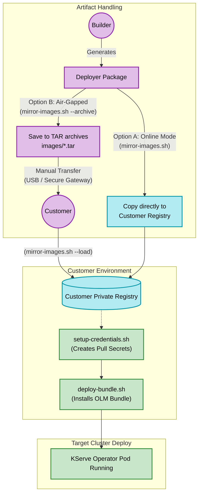
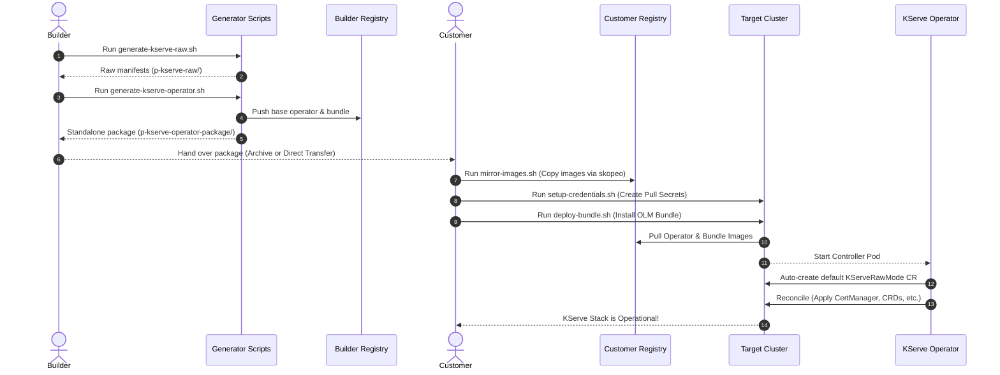

# KServe Operator — Visual Architecture Overview

This document provides a high-level, conceptual look at the KServe Operator generation and deployment lifecycle. It is designed to be easily readable and breaks down the system into three distinct phases: **The Build Factory**, **The Deployer Journey**, and **The Operator Brain**.

---

## Phase 1: The Build Factory (Generation)

This diagram illustrates how the shell scripts ingest upstream KServe manifests and transform them into distributable artifacts.

```mermaid
graph LR
  classDef source fill:#f9d0c4,stroke:#e92758,stroke-width:2px,color:#000
  classDef engine fill:#ffe6a7,stroke:#ff9f1c,stroke-width:2px,color:#000
  classDef output fill:#d4e157,stroke:#689f38,stroke-width:2px,color:#000
  classDef package fill:#bbdefb,stroke:#1976d2,stroke-width:2px,color:#000
  classDef helper fill:#eceff1,stroke:#607d8b,stroke-width:1px,stroke-dasharray: 4 4,color:#000

  subgraph Source [1. Upstream Source]
    Upstream[(KServe GitHub\nMaster Branch)]:::source
  end

  subgraph Engine [2. Processing Pipeline]
    RawExtract[[generate-kserve-raw.sh\n(Extracts & Patches)]]:::engine
    OpGen[[generate-kserve-operator.sh\n(Scaffolds Operator)]]:::engine
  end

  subgraph Artifacts [3. Output Deliverables]
    Bundle[(OLM Bundle\nContainer Image)]:::output
    OpImage[(Operator\nContainer Image)]:::output
    Package{Customer\nDeployer Package}:::package
  end
  
  subgraph CustomerPkg [Inside Deployer Package]
    direction TB
    Scripts[Helper Scripts:\n• mirror-images.sh\n• setup-credentials.sh\n• deploy-bundle.sh]:::helper
  end

  Upstream --> RawExtract
  RawExtract -.->|Base Raw Manifests| OpGen
  OpGen -->|make bundle| Bundle
  OpGen -->|docker buildx| OpImage
  OpGen -->|kustomize| Package
  
  Package -.- CustomerPkg
```

---

## Phase 2: The Deployer Journey

This illustrates how the generated deliverables travel from the builder to the target customer environment, handling both online and strictly air-gapped scenarios.



---

## Phase 3: The Operator Brain (Auto-Init & Reconciliation)

Once installed on the cluster, the Operator runs autonomously. This state diagram shows the internal logic of the operator as it boots up and installs KServe.

```mermaid
stateDiagram-v2
    classDef default fill:#fafafa,stroke:#333,stroke-width:1px
    classDef applying fill:#e1f5fe,stroke:#0288d1,stroke-width:2px
    classDef ready fill:#e8f5e9,stroke:#2e7d32,stroke-width:2px,font-weight:bold
    classDef trigger fill:#fff3e0,stroke:#ff9800,stroke-width:2px,font-style:italic
    
    [*] --> OperatorStartup
    OperatorStartup --> AutoInitPhase : Manager Starts
    
    state AutoInitPhase {
        direction LR
        CreateCR: Auto-create default KServeRawMode CR
        WatchTrigger: Operator watches for CR creation
        CreateCR --> WatchTrigger
    }
    
    AutoInitPhase --> ReconciliationLoop : Triggers Watch Event:::trigger
    
    state ReconciliationLoop {
        step1: 1. Apply cert-manager manifests
        step2: 2. Apply KServe CRDs
        step3: 3. Apply RBAC & Namespaces
        step4: 4. Apply KServe Controller
        step5: Poll Wait for Webhooks to stabilise
        step6: 5. Apply Serving Runtimes
        
        step1 --> step2:::applying
        step2 --> step3:::applying
        step3 --> step4:::applying
        step4 --> step5:::applying
        step5 --> step6:::applying
    }
    
    ReconciliationLoop --> KServeOperational:::ready
    KServeOperational --> SteadyStateWatch
    
    SteadyStateWatch --> [*] : KServe Ready for InferenceServices
```

---

## Phase 4: Actor Sequence Diagram (End-to-End Execution)

This sequence diagram details the chronological interaction between the Builders, Customers, Scripts, and Kubernetes.



---

## Phase 5: Flow Diagram (Manifest Transformation Data Pipeline)

This flowchart highlights the inner workings behind how the original KServe YAML files are modified, compiled into Go code, and shipped in the Docker image.

```mermaid
flowchart LR
    classDef file fill:#fff8e1,stroke:#ffa000,stroke-width:2px,color:#000
    classDef process fill:#e1f5fe,stroke:#0288d1,stroke-width:2px,color:#000
    classDef active fill:#e8f5e9,stroke:#388e3c,stroke-width:2px,color:#000

    GH[GitHub KServe Release]:::file -- Downloaded via script --> Extractor[Kustomize Build]:::process
    Extractor -- Removes Istio/Knative --> Raw[Raw YAMLs]:::file
    Raw -- Patched for RawDeployment --> PatchedRaw[Functional Raw Manifests]:::file
    
    PatchedRaw -- Injected as String Literals --> GoCode[Operator bindata (Go)]:::process
    GoCode -- Compiled --> Bin[Operator Binary]:::file
    Bin -- Containerized --> Img[Operator Linux Docker Image]:::active
```
