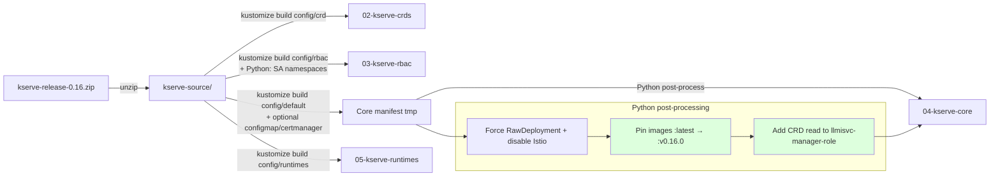
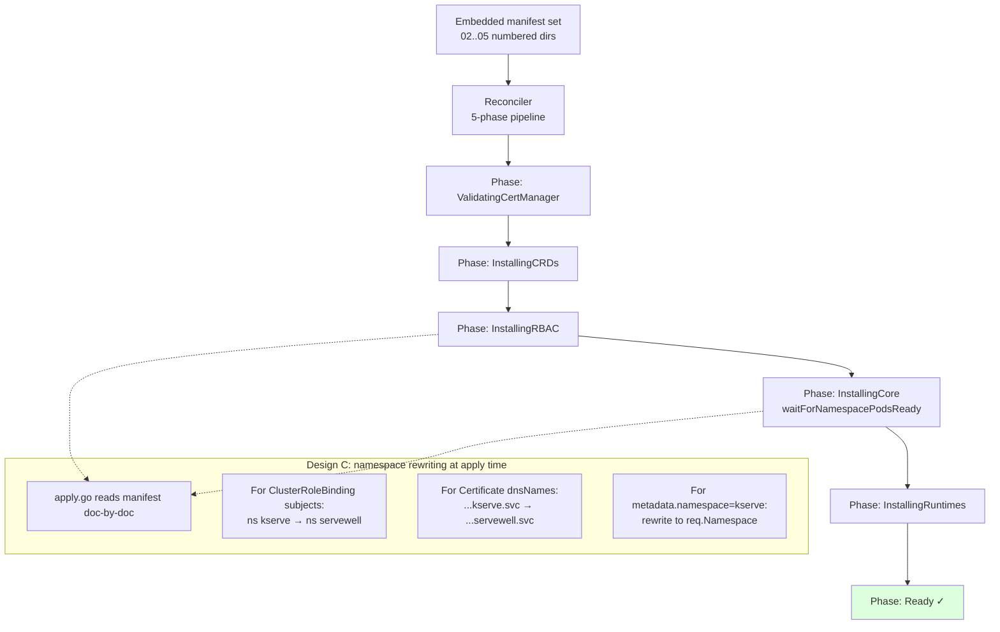

# Migrating to KServe 0.16: What Broke, What We Tried, What Actually Fixed It

_Documented 2026-05-20. Branch: `feat/kserve-0.16`. Operator tag at point of success: `v604`._

This is the narrative of moving the generator pipeline from `kserve-master` (Feb 2026) to `kserve-release-0.16` (Dec 2023), including the wrong turns. The final fix is much smaller than the journey suggests — but the journey is the documentation, because the wrong turns reveal _why_ each piece of the fix is needed.

---

## TL;DR — the working fix

Two patches in `generate-kserve-raw.sh`, no source-tree edits:

1. **Pin upstream KServe controller images to `v0.16.0`** — 0.16's manifests reference `kserve/llmisvc-controller:latest`, `kserve-localmodel-controller:latest`, `kserve-localmodelnode-agent:latest`. `:latest` drifts to newer binaries whose runtime expectations exceed the bundled manifests.
2. **Add `customresourcedefinitions: get/list/watch` to the `llmisvc-manager-role` ClusterRole** — the published `llmisvc-controller` binary does a storage-version-migration check on startup that reads CRDs. Upstream KServe ships neither the right ClusterRole nor a flag to skip the check.

Result on a fresh cluster: KServeRawMode reaches `Ready` in **2m23s**, all 3 controllers run with **0 restarts**, Iris inference returns `{"predictions":[1]}`.

---

## Starting point

Before this work the pipeline successfully built and deployed an operator from `kserve-master` (Feb 2026 source). Two clean E2E runs were on file: one with KServe namespace `kserve`, one with `servewell`. Stage-1 (`generate-kserve-raw.sh`) extracts manifests, stage-2 (`generate-kserve-operator.sh`) builds an Operator-SDK project with those manifests embedded.

The hypothesis we tested: swap the bundled source from master to `kserve-release-0.16.zip` and reuse the same generator pipeline.

---

## Why 0.16's `config/default` differs from master's

This is the root cause of every downstream issue.

```
config/default/kustomization.yaml — resources block

  master (Feb 2026)              0.16 (Dec 2023)
  ─────────────────              ─────────────────
  ../certmanager/kserve          ../crd
  ../crd                         ../configmap            ← extra
  ../rbac                        ../rbac
  ../manager                     ../manager
  ../webhook                     ../webhook
                                 ../certmanager
                                 ../localmodels          ← extra
                                 ../localmodelnodes      ← extra
                                 ../llmisvc              ← extra
```

Master removed `localmodels`, `localmodelnodes`, `llmisvc` from the default overlay — they became optional opt-ins. 0.16 still bundles them, but **0.16's bundled deployment was never made standalone-installable**: the manifests are incomplete relative to the binaries the project publishes.

---

## The journey, in order

### Issue 1 — Duplicate ConfigMap / Issuer in stage-3 output

**Symptom:** After swapping to 0.16, `kustomize build config/default` produced output that already contained the `inferenceservice-config` ConfigMap and the cert-manager `Issuer`. Our pipeline then **appended** them again via separate `kustomize build config/configmap` and `kustomize build config/certmanager` calls. Result: two copies of each resource in `04-kserve-core/kserve-core.yaml`.

**Why master didn't show it:** master's `config/default/kustomization.yaml` doesn't include `../configmap` or `../certmanager`, so the explicit appends in the pipeline weren't duplicating anything.

**Fix:** version-agnostic guard — only append if the resource isn't already in the kustomize-default output.

```bash
if ! grep -q "^  name: inferenceservice-config$" "${CORE_TMP}"; then
    kustomize build config/configmap >> "${CORE_TMP}"
fi
if ! grep -q "^kind: Issuer$" "${CORE_TMP}"; then
    kustomize build config/certmanager >> "${CORE_TMP}"
fi
```

### Issue 2 — ClusterRoleBindings rejected for empty subject namespace

**Symptom:** Reconcile loop. CR cycling `ValidatingCertManager → InstallingCRDs → InstallingRBAC → ValidatingCertManager`. Operator logs:

```
failed to apply resource ClusterRoleBinding kserve-localmodel-manager-rolebinding:
  ClusterRoleBinding.rbac.authorization.k8s.io "kserve-localmodel-manager-rolebinding"
  is invalid: subjects[0].namespace: Required value
```

**Why:** the source ClusterRoleBindings for `localmodel` and `llmisvc` list ServiceAccount subjects **without** a `namespace`. The kustomize `namespace: kserve` directive doesn't apply to ClusterRoleBinding subjects (cluster-scoped resource). The stage-1 Python RBAC patcher only fixed the namespace for one specific SA (`kserve-controller-manager`) — newer KServe versions added more SAs that the patcher didn't know about.

**Fix:** generalise the patcher. For every ClusterRoleBinding subject that is a ServiceAccount and has no namespace, default it to `"kserve"`. The operator's runtime `apply.go` then rewrites `"kserve"` to the user-chosen target namespace.

```python
if kind == "ClusterRoleBinding":
    for subject in doc.get("subjects", []):
        if subject.get("kind") == "ServiceAccount" and not subject.get("namespace"):
            subject["namespace"] = "kserve"
```

### Issue 3 (wrong turn) — localmodel "missing webhook TLS cert"

**Symptom:** With Issues 1+2 fixed, RBAC applied cleanly, but `kserve-localmodel-controller-manager` Pod went into `CrashLoopBackOff`:

```
unable to run the manager:
  open /tmp/k8s-webhook-server/serving-certs/tls.crt: no such file or directory
```

**What I assumed:** the localmodel Deployment manifest is missing a `volumeMount`. I diffed `config/localmodels/manager.yaml` between 0.16 and master and found that **master adds** `livenessProbe`, `readinessProbe`, `containerPort: 9443`, a `cert` `volumeMount`, and a `volumes` entry referencing a `localmodel-webhook-server-cert` Secret. Master also adds `config/certmanager/localmodel/certificate.yaml` to produce that Secret.

**What I did (wrong):** wrote a Python post-processor that forward-ported all of those fields into the 0.16 manifest and appended a new `localmodel-serving-cert` Certificate.

**Why I should have been skeptical:** the user pushed back — "I hope you are not making up configurations." That was the right instinct. I was forward-porting master's manifest to fit master's _newer_ binary, but we were still pulling `:latest` (which on Docker Hub was even newer than master). Two layers of mismatch.

### The real root cause was hidden by Issue 4

The localmodel pod was actually a **symptom**, not the source. The operator reconcile was failing earlier in the apply order at a different resource, **before** it reached the localmodel Certificate I had appended. I missed this initially because I was reading the symptom (localmodel pod logs) instead of the operator's reconcile logs.

### Issue 4 — llmisvc blocks the entire reconcile

**Symptom (in operator logs):**

```
failed to apply resource LLMInferenceServiceConfig kserve-config-llm-decode-template:
  Internal error occurred: failed calling webhook
  "llminferenceserviceconfig.kserve-webhook-server.validator":
  failed to call webhook: ... dial tcp 10.98.66.248:443: connect: connection refused
```

**Chain of failure:**

1. `llmisvc-controller-manager` Pod crashes at startup with
   `customresourcedefinitions ... is forbidden: User "system:serviceaccount:servewell:llmisvc-controller-manager" cannot get resource "customresourcedefinitions"`.
2. → the Service `llmisvc-webhook-server-service` has no backing Pod, refuses connections.
3. → operator's Server-Side Apply on `LLMInferenceServiceConfig` calls the webhook → connection refused.
4. → the admission webhook's `failurePolicy: Fail` turns this into a hard error.
5. → reconciler errors out **at this resource in the manifest**.
6. → every resource after it (including the localmodel Certificate I had appended at the end) is **never applied**.
7. → no Secret is ever issued for the localmodel webhook → localmodel pod stuck in `ContainerCreating` for the new manifest, or in CrashLoopBackOff for the old one.

**Why:** the published `kserve/llmisvc-controller:latest` binary calls a startup storage-version-migration that requires `customresourcedefinitions` read permission. **Neither 0.16 nor master grants this anywhere in `config/`**. So this is a genuine upstream gap — the binary needs a permission the manifests don't grant.

**Across 188 reconcile attempts logged, `localmodel-serving-cert` was applied 0 times.** That single fact diagnosed everything: the operator was never actually getting past the llmisvc-blocked LLMInferenceServiceConfig apply, so no amount of localmodel-side fixing could matter.

### Issue 5 — `:latest` was making everything worse

While diagnosing llmisvc, I noticed the stack trace in its crash logs referenced `cmd/llmisvc/main.go:361`. 0.16's source `main.go` is 198 lines; master's is 293 lines. Neither matched. The image at `kserve/llmisvc-controller:latest` had been published _after_ master. The binary in the cluster was a third version, with its own RBAC expectations exceeding both 0.16 and master's manifests.

This explains why my localmodel "cert mount" fix (forward-ported from master, copied into the running pod) caused a new failure mode — the v0.16.0 binary doesn't have `/healthz` or `/readyz` endpoints at all. My added `livenessProbe`/`readinessProbe` returned 404 → kubelet killed the pod → restart loop. **My fix caused its own failure mode**.

---

## The fix that actually worked

After verifying with `docker manifest inspect` that `kserve/llmisvc-controller:v0.16.0`, `kserve/kserve-localmodel-controller:v0.16.0`, and `kserve/kserve-localmodelnode-agent:v0.16.0` all exist on Docker Hub, the fix collapsed to:

```python
# In generate-kserve-raw.sh stage 3 post-processor:

IMAGE_PIN = {
    "kserve/llmisvc-controller":           "kserve/llmisvc-controller:v0.16.0",
    "kserve/kserve-localmodel-controller": "kserve/kserve-localmodel-controller:v0.16.0",
    "kserve/kserve-localmodelnode-agent":  "kserve/kserve-localmodelnode-agent:v0.16.0",
}

CRD_PERMISSION = {
    "apiGroups": ["apiextensions.k8s.io"],
    "resources":  ["customresourcedefinitions"],
    "verbs":      ["get", "list", "watch"],
}

# For every Deployment/DaemonSet container, rewrite :latest -> :v0.16.0 for the
# three pinned repos.
# For the llmisvc-manager-role ClusterRole, append CRD_PERMISSION if not present.
```

Everything I had added for the localmodel webhook (probes, port, volumeMount, volume, Certificate) was **removed**. The v0.16.0 localmodel binary doesn't start a webhook server, doesn't expose `/healthz`/`/readyz`, doesn't mount a cert — leaving the 0.16 Deployment manifest alone is correct.

---

## Diagrams

### How the failure cascade worked (the chain we had to break)

```mermaid
flowchart TD
    A[Operator reconcile starts]
    A --> B[InstallingCRDs ✓]
    B --> C[InstallingRBAC]
    C --> D{ClusterRoleBinding<br/>subject ns set?}
    D -- no --> E[REJECT: subjects[0].namespace required<br/>Issue 2]
    D -- yes --> F[InstallingCore: apply manifest top-to-bottom]
    F --> G[Apply Deployments incl. llmisvc-controller-manager]
    G --> H{llmisvc Pod starts?}
    H -- crashes:<br/>CRD perm missing --> I[llmisvc-webhook-server-service<br/>has no backend]
    I --> J[Apply LLMInferenceServiceConfig]
    J --> K{Webhook call to<br/>llmisvc service}
    K -- connection refused<br/>failurePolicy=Fail --> L[Reconciler errors here<br/>Issue 4]
    L --> M[Resources AFTER this never applied<br/>incl. our appended Certificate]
    M --> N[localmodel Secret never issued]
    N --> O[localmodel Pod stuck<br/>Issue 3 symptom]
    H -- starts cleanly --> P[Continue applying remaining manifest]
    P --> Q[InstallingRuntimes ✓ → Ready]

    style E fill:#fdd
    style L fill:#fdd
    style O fill:#fdd
    style Q fill:#dfd
```

The fix breaks the chain at H: with the image pinned to `v0.16.0` and the CRD permission added, the llmisvc Pod starts cleanly, the webhook service has a backend, and everything downstream applies in order.

### Where the two fixes live in the pipeline



### What the operator embeds and applies on the cluster



---

## Lessons learned

| What I did | What I should have done |
|---|---|
| Diagnosed by reading the failing pod's logs (localmodel) | Read the **operator's reconcile logs** first — they tell you exactly which resource the apply died on. The pod failure was downstream of a much earlier reconcile error. |
| Forward-ported master's manifest to fix 0.16 | Asked first: what is the **image tag actually deployed**? When manifest version and binary version disagree, fix that mismatch — don't patch the manifest to match a newer binary unless you also pin the binary. |
| Added livenessProbe/readinessProbe paths copied from master | Probes are part of the binary's API contract. Different binary version → different endpoints. Use TCP probes if you're guessing, or use no probes. |
| Took features as "should just work" because they don't touch Knative/Istio | "No banned dependency" is necessary but not sufficient. Verify by running. 0.16 ships localmodels/llmisvc in `config/default` but never made the deployment standalone-installable upstream. |

The user's instinct to push back ("are you making up configuration?") and to ask for a fresh cluster test ("is everything all right? should we reset?") were both correct. The fresh-cluster test specifically caught that my localmodel patch was harmful (404 probe failures masking nothing real) — without the reset I might have kept "fixing" a problem I had created.

---

## What's still open on this branch

- Label a node with `kserve/localmodel=worker` so the `kserve-localmodelnode-agent` DaemonSet (currently `desired=0`) actually schedules. Without this, the LocalModelCache feature won't pre-fetch anything, but it also doesn't break installation.
- Add Iris-style smoke tests targeting LocalModelCache and LLMInferenceService specifically, so future regressions in those subsystems get caught here instead of on a customer cluster.

---

## Appendix: file diff summary on `feat/kserve-0.16` vs `main`

| File | Change |
|---|---|
| `kserve-master.zip` | removed |
| `kserve-release-0.16.zip` | added |
| `generate-kserve-raw.sh` | `-z/--zip` argument, auto-extract to generic `kserve-source/`, version-agnostic dedup for configmap+certmanager appends, generalised SA-namespace defaulter in RBAC, image-pin + CRD-permission post-processor in Core |
| `kserve-operator-base/apply.go.tmpl` | pod-readiness timeout 5 → 10 min (extra deployments to wait for) |
| `.gitignore` | add `kserve-source/` |
