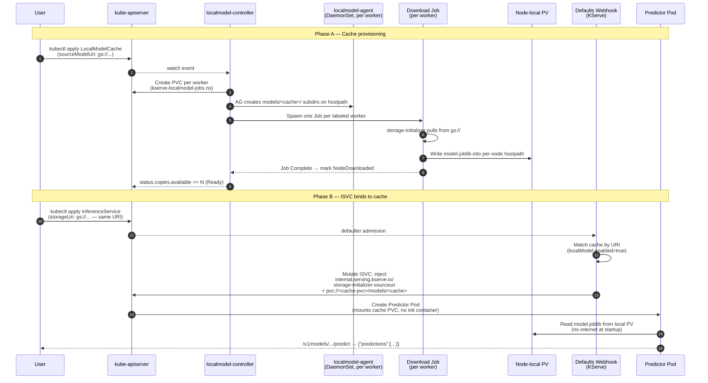

# LocalModelCache — User Guide

`LocalModelCache` pre-fetches model weights into per-node persistent storage so InferenceServices start fast and survive without re-fetching from the original source on every Pod restart. The KServe defaults webhook auto-injects the cached PVC into matching ISVCs — the user just deploys an ISVC with the **same `storageUri`** as the cache's `sourceModelUri`.

This guide covers two flows:
- **Online** — cache fetches from a public source (`gs://`, `s3://`, `https://`, etc.)
- **Air-gapped (offline)** — cache copies from a user-populated PVC (`pvc://`); no internet egress needed at runtime

---

## Prerequisites

### 1. A multinode Kubernetes cluster

LocalModelCache fans a model across multiple worker nodes, so it needs N > 1 workers. Most production clusters (EKS, GKE, AKS, OpenShift) already meet this — no extra setup. For local testing, [kind](https://kind.sigs.k8s.io/), [k3d](https://k3d.io/), or `minikube --nodes=3` are all fine. A ready-made kind config is shipped at [`extra-docs/kind-multinode.yaml`](kind-multinode.yaml) if you pick kind.

> **Note:** single-node Docker Desktop Kubernetes can't exercise per-node fan-out.

### 2. Operator already deployed

You should have completed Part A + Part B Steps 0–5 of [QUICK_START.md](../QUICK_START.md) — operator running, KServeRawMode CR `Ready`, iris standard ISVC working.

### 3. Label worker nodes

The `kserve-localmodelnode-agent` DaemonSet uses `nodeSelector: kserve/localmodel=worker`. Label every node you want to host the cache (typically all worker nodes, leaving control-plane unlabeled). Substitute `<your-worker-name>` with the actual node names from `kubectl get nodes`:

```bash
kubectl label node <worker-1> kserve/localmodel=worker
kubectl label node <worker-2> kserve/localmodel=worker

# Verify the DaemonSet now schedules:
kubectl get ds -n kserve kserve-localmodelnode-agent
# DESIRED == <number of labeled workers>, CURRENT == DESIRED, READY == DESIRED
```

### 4. Apply the continuous-chown helper *(dev clusters only)*

> **Production clusters using CSI drivers (EBS, GCE PD, Azure Disk, OpenShift LocalVolume, etc.) skip this step entirely** — `fsGroup` propagates correctly through CSI volumes. This workaround is only for dev clusters using hostpath-backed PVs (Docker Desktop, kind, minikube — kubelet does NOT honor `fsGroup` chown there, so the download Job fails with `PermissionError: [Errno 13] Permission denied: '/mnt/models/model.joblib.…'`).

**Why a continuous-chown DaemonSet (not a one-shot Pod):** the localmodel-agent runs as root and creates `models/<cache-name>/` subdirectories on its own cadence as the cache download progresses — sometimes seconds after the user's "after-apply" chown. A single chown can't close the race; subsequent agent-created subdirs are still root-owned, the download Job (UID 1000) can't write, the Job fails, the controller retries on a ~30 s backoff, and the loop continues. The shipped helper DaemonSet runs a 30 s chown loop on each labeled worker until you delete it, deterministically closing the window.

Apply the helper **before** the LocalModelCache CR; delete it **after** the cache reaches `NodeDownloaded` on all worker copies.

```bash
# 1. Apply the helper. Schedules one Pod per node labeled kserve/localmodel=worker.
kubectl apply -f 06-sample-model/chown-hostpath-helper.yaml
kubectl rollout status daemonset/chown-hostpath-helper \
  -n kserve-localmodel-jobs --timeout=60s

# 2. Proceed with the LocalModelCache flow (online or air-gap — see below)
#    The cache will reach copies.available == N-workers WITHOUT manual chown rounds.

# 3. After the cache is fully populated, delete the helper:
kubectl delete -f 06-sample-model/chown-hostpath-helper.yaml
```

The helper Pod is tiny (busybox, ~10 MB, runs a `chown -R 1000:1000 /host-models; sleep 30` loop). Each chown after the first is a no-op once everything is owned 1000:1000.

> **If you already started the LocalModelCache flow without the helper** and see download Jobs in `Error` state, apply the helper now, then re-trigger the failed Jobs: `kubectl delete jobs -n kserve-localmodel-jobs --all`. The controller will recreate fresh Jobs and they'll succeed.

---

## Online flow (gs://)

Uses the cache samples shipped at `p-kserve-operator-package/06-sample-model/`.

### Step 1 — Create the LocalModelNodeGroup

```bash
kubectl apply -f 06-sample-model/localmodelcache-nodegroup.yaml
kubectl get localmodelnodegroup default-worker
```

The NodeGroup defines a static PV template with `storageClassName: hostpath` on **both** the PV and PVC specs (a previous bug caused the PVC to default to the cluster default class and never bind — fixed in the shipped sample).

### Step 2 — Create the LocalModelCache

```bash
kubectl apply -f 06-sample-model/localmodelcache.yaml

# Watch until BOTH workers reach NodeDownloaded:
kubectl get localmodelcache sklearn-iris-cache -w
# status.copies.available eventually == 2; status.total == 2
```

The localmodel-controller-manager spawns one download Job per labeled worker. Each Job runs the storage-initializer that fetches `gs://kfserving-examples/models/sklearn/1.0/model` into a node-local PV. Per-node PVs end up in the `kserve-localmodel-jobs` namespace (the operator bundles this namespace — you don't create it manually).

### Step 3 — Deploy an ISVC that uses the cache

`LocalModelCache` itself is **cluster-scoped** (no namespace), but the *consumer ISVC* lives in the workload namespace (Design D #3, default `default`). See [`design-d-three-namespace-model.md`](design-d-three-namespace-model.md).

```bash
kubectl apply -n "${KSERVE_WORKLOAD_NS:-default}" -f 06-sample-model/localmodelcache-isvc.yaml
kubectl wait --for=condition=Ready isvc/sklearn-iris-cached -n "${KSERVE_WORKLOAD_NS:-default}" --timeout=300s
```

The ISVC's `storageUri` is **the same `gs://...` URI** as the cache's `sourceModelUri`. The KServe defaults webhook recognises the match and rewrites the predictor's volume to mount the cache PVC instead of pulling from gs://. Proof of injection:

```bash
kubectl get isvc sklearn-iris-cached -n default \
  -o jsonpath='{.metadata.annotations.internal\.serving\.kserve\.io/localmodel-pvc-name}'
# Expected: sklearn-iris-cache-default-worker

kubectl get po -n default \
  -l serving.kserve.io/inferenceservice=sklearn-iris-cached \
  -o jsonpath='{.items[0].spec.volumes[?(@.name=="kserve-pvc-source")].persistentVolumeClaim.claimName}'
# Expected: sklearn-iris-cache-default-worker
```

### Step 4 — Run inference

```bash
kubectl run --rm -i curl-test --image=curlimages/curl --restart=Never -- \
  curl -s -H "Content-Type: application/json" \
  -d '{"instances":[[6.8,2.8,4.8,1.4]]}' \
  http://sklearn-iris-cached-predictor.default.svc.cluster.local/v1/models/sklearn-iris-cached:predict
```

✅ Expected: `{"predictions":[1]}`. The predictor pod loaded the model from the **local PVC** — no network egress to gs:// at startup.

---

## Air-gapped flow (s3:// via in-cluster Minio)

Use this when the cluster has no internet egress (the original raison d'être of this operator).

> **Why not `pvc://`?** KServe v0.16.0's LocalModelCache download Job supports **only** `s3://`, `gs://`, `http(s)://`, and `abfs://`. It does **not** support `pvc://`, `file://`, `hf://`, or a "skip download / pre-populated" mode. The constraint is hard-coded in [`pkg/agent/storage/provider.go:26-36`](https://github.com/kserve/kserve/blob/v0.16.0/pkg/agent/storage/provider.go) (`SupportedProtocols`). So the only honest air-gap path is to run an S3-compatible store **inside** the cluster (Minio) and point the LocalModelCache at it via `s3://`. `pvc://` IS still valid for a regular ISVC **without** LocalModelCache — see [`QUICK_START.md` Part C](../QUICK_START.md) / T07 for that pattern. The two are independent.

This section is the explainer; the imperative recipe lives next to the YAMLs at [`p-kserve-raw/06-sample-model/airgap-localmodelcache/README.md`](../kserve-raw-base/airgap-localmodelcache/README.md) (after package generation, `06-sample-model/airgap-localmodelcache/README.md`).

### What ships

The package generator copies a self-contained `airgap-localmodelcache/` sub-directory into `06-sample-model/`. It contains 9 YAMLs plus a pre-baked sklearn iris `model.joblib` so you can run the demo without any internet egress at apply time (assuming images are mirrored — see below):

| File | Role |
|---|---|
| `00-minio-namespace.yaml` | `Namespace: minio` |
| `01-minio-credentials.yaml` | Root creds (`minioadmin/minioadmin` — DEV ONLY) |
| `02-minio-deployment.yaml` | Single-replica Minio, `emptyDir`-backed `/data` |
| `03-minio-service.yaml` | ClusterIP at `minio.minio.svc:9000` |
| `04-minio-bootstrap-job.yaml` | One-shot Job: `mc mb` + `mc cp` of the model |
| `05-localmodel-s3-credentials.yaml` | AWS-style Secret in `kserve-localmodel-jobs` ns |
| `06-clusterstoragecontainer-s3.yaml` | **The critical piece** — see below |
| `07-localmodelcache-airgap.yaml` | LocalModelCache with `s3://` URI |
| `08-localmodelcache-airgap-isvc.yaml` | ISVC matching the cache's URI |
| `model.joblib` | Pre-trained sklearn iris model fixture |

### The critical piece: `ClusterStorageContainer`

Out of the box, KServe v0.16.0 ships the `ClusterStorageContainer` **CRD** but no instances. The localmodelnode controller ([`pkg/controller/v1alpha1/localmodelnode/controller.go:175-203`](https://github.com/kserve/kserve/blob/v0.16.0/pkg/controller/v1alpha1/localmodelnode/controller.go)) selects one whose `workloadType=localModelDownloadJob` AND `supportedUriFormats` prefix matches the cache's URI. If none match, it falls back to a bare default container (image only, no env, no creds) — that's why the online flow works for public `gs://` buckets but private/auth flows need wiring.

`06-clusterstoragecontainer-s3.yaml` provides that wiring: it tells the controller "when downloading any `s3://` URI for a LocalModelCache, use this container with this env: `AWS_ACCESS_KEY_ID` + `AWS_SECRET_ACCESS_KEY` from the Secret, plus `AWS_ENDPOINT_URL=http://minio.minio.svc:9000`."

### Steps

```bash
# 0. Prereq — operator deployed, worker nodes labeled, NodeGroup applied
#    (see "Prerequisites" section above)

# 1. Stand up in-cluster Minio
kubectl apply -f 06-sample-model/airgap-localmodelcache/00-minio-namespace.yaml
kubectl apply -f 06-sample-model/airgap-localmodelcache/01-minio-credentials.yaml
kubectl apply -f 06-sample-model/airgap-localmodelcache/02-minio-deployment.yaml
kubectl apply -f 06-sample-model/airgap-localmodelcache/03-minio-service.yaml
kubectl wait --for=condition=Available deployment/minio -n minio --timeout=180s

# 2. Seed the iris model into Minio
kubectl create configmap -n minio iris-model-seed \
  --from-file=model.joblib=06-sample-model/airgap-localmodelcache/model.joblib
kubectl apply -f 06-sample-model/airgap-localmodelcache/04-minio-bootstrap-job.yaml
kubectl wait --for=condition=Complete job/minio-bootstrap -n minio --timeout=120s

# 3. Wire up LocalModelCache to authenticate to Minio
kubectl apply -f 06-sample-model/airgap-localmodelcache/05-localmodel-s3-credentials.yaml
kubectl apply -f 06-sample-model/airgap-localmodelcache/06-clusterstoragecontainer-s3.yaml

# 4. Apply NodeGroup (existing) + air-gap Cache
kubectl apply -f 06-sample-model/localmodelcache-nodegroup.yaml
kubectl apply -f 06-sample-model/airgap-localmodelcache/07-localmodelcache-airgap.yaml
# Watch until copies.available == number of worker nodes:
kubectl get localmodelcache sklearn-iris-cache-airgap -w -o jsonpath='{.status}{"\n"}'

# 5. Apply ISVC and run inference
kubectl apply -f 06-sample-model/airgap-localmodelcache/08-localmodelcache-airgap-isvc.yaml
kubectl wait --for=condition=Ready isvc/sklearn-iris-cached-airgap --timeout=180s
kubectl run -i curl-test --image=curlimages/curl --restart=Never -- \
  curl -s -H 'Content-Type: application/json' \
  -d '{"instances":[[6.8,2.8,4.8,1.4]]}' \
  http://sklearn-iris-cached-airgap-predictor.default.svc.cluster.local/v1/models/sklearn-iris-cached-airgap:predict
# Expected: {"predictions":[1]}
kubectl delete pod curl-test
```

✅ Expected: `{"predictions":[1]}` with **zero internet egress** at predictor startup AND at download time (Minio + storage-initializer images are local-cluster assumptions).

### Verifying it's actually air-gapped

```bash
# Download Job talked only to Minio:
JOB_POD=$(kubectl get pod -n kserve-localmodel-jobs -l model=sklearn-iris-cache-airgap -o jsonpath='{.items[0].metadata.name}')
kubectl logs -n kserve-localmodel-jobs "$JOB_POD"

# Env injection landed:
kubectl get pod -n kserve-localmodel-jobs "$JOB_POD" \
  -o jsonpath='{.spec.containers[0].env[?(@.name=="AWS_ENDPOINT_URL")].value}{"\n"}'
# Expected: http://minio.minio.svc:9000

# Predictor pod mounts the cache PVC (not Minio directly):
kubectl describe pod -l serving.kserve.io/inferenceservice=sklearn-iris-cached-airgap | grep -A2 'Volumes'
```

### Production checklist

The shipped sample is **deliberately minimal** for the demo. Before adapting for production:

| Demo choice | Production replacement |
|---|---|
| `minio/minio` with hardcoded `minioadmin/minioadmin` | Hardened S3-compatible store with rotated credentials from your secret manager |
| `emptyDir` `/data` | PVC bound to a CSI-backed StorageClass |
| Internet-pulled `quay.io/minio/minio:…` / `minio/mc:…` | Tags mirrored into your private registry (extend `mirror-images.sh`) |
| Secrets in plain YAML | sealed-secrets / external-secrets-operator / SOPS |
| `S3_USE_HTTPS=0`, `S3_VERIFY_SSL=0` | TLS-terminated Minio + proper CA on the storage-initializer trust store |
| Single replica Minio | Distributed Minio (Operator) for HA |

---

## How it works

### Cache lifecycle — visual



### Same flow, plain-text ASCII

```
              ┌─────────────────────────────┐
              │ LocalModelCache (CR)        │
              │   sourceModelUri: gs://...  │
              │   nodeGroups: [default-...] │
              └────────────┬────────────────┘
                           │ controller spawns one download Job
                           │ per labeled worker → fetches into
                           │ per-node hostpath PV → PVC bound
                           ▼
              ┌─────────────────────────────┐
              │ kserve-localmodel-jobs ns   │
              │  - PV (per node)            │
              │  - PVC (shared)             │
              │  - Download Job (per node)  │
              └─────────────────────────────┘

              ┌─────────────────────────────┐
              │ InferenceService            │
              │   storageUri: gs://...      │
              │       ↑                     │
              │       │ (same URI as cache) │
              └────────────┬────────────────┘
                           │ defaults webhook matches by URI
                           │ injects internal annotations
                           │ rewrites predictor's volume
                           ▼
              ┌─────────────────────────────┐
              │ Predictor Pod               │
              │   volume kserve-pvc-source  │
              │     -> cache PVC            │
              │   model loads from local PV │
              │   no internet at startup    │
              └─────────────────────────────┘
```

Two flags govern the auto-injection — both already correct in the operator's bundled ConfigMap:
- `localModel.enabled: true` — without this, the webhook silently skips the URI match (upstream's default is `false`)
- `localModel.defaultJobImage: kserve/storage-initializer:v0.16.0` — pinned by the generator

---

## Cleanup

In this order to avoid orphaned resources:

```bash
# 1. Delete the ISVC first — its predictor pod holds a reference to the cache PVC.
kubectl delete isvc sklearn-iris-cached -n default
#    (or sklearn-iris-cached-offline for the offline flow)

# 2. Delete the LocalModelCache — controller deletes the per-node PVs/PVCs.
kubectl delete localmodelcache sklearn-iris-cache
#    (or sklearn-iris-cache-offline)

# 3. Delete the NodeGroup if you're done with caching entirely.
kubectl delete localmodelnodegroup default-worker

# Verify no orphaned PVs:
kubectl get pv | grep sklearn-iris-cache    # should be empty after ~30s
```

The PVs have `reclaimPolicy: Delete` so they self-destruct when their PVC is deleted. If the controller is stuck (rare — finalizers haven't run), you may need to manually clear finalizers on stuck resources.

---

## Troubleshooting

| Symptom | Likely cause | Fix |
|---|---|---|
| Cache stays `NodeDownloadPending` forever | PVC not bound — usually storage class mismatch | Check `kubectl get pvc -n kserve-localmodel-jobs`. The PV and PVC must use the **same** `storageClassName`. The shipped sample pins `hostpath` on both. |
| Download Job pod errors with `PermissionError: '/mnt/models/model.joblib.…'` | Hostpath directory or subdir is root-owned; fsGroup doesn't propagate on hostpath PVs | Apply the continuous-chown helper DaemonSet: `kubectl apply -f 06-sample-model/chown-hostpath-helper.yaml`. See [Prerequisites § 4](#4-apply-the-continuous-chown-helper-dev-clusters-only). |
| ISVC predictor pod is `Pending` with `PVC not found` | The defaults webhook did not inject the cache PVC | Check `localModel.enabled` in the inferenceservice-config ConfigMap — it must be `true`. Check the ISVC `storageUri` **exactly** matches the LocalModelCache `sourceModelUri`. |
| LocalModelCache CR creation fails with webhook 404 | Core kserve-controller image is not v0.16.0 — older binaries lack the LocalModelCache validation handler | Re-run the operator build; ensure the v0.16.0 pin is in the embedded manifest. |
| Multi-namespace ISVC doesn't see the cache | Cache PVC is in `kserve-localmodel-jobs`; defaults webhook creates per-ISVC-namespace PVCs only when `enabled=true` | Same as above — check `localModel.enabled`. |
| `kubectl delete isvc <name>` hangs; ISVC has `deletionTimestamp` set but won't disappear | KServe v0.16.0 upstream bug — defaulting webhook re-injects the LocalModelCache PVC annotation during finalizer-removal; validator then rejects with "`deploymentMode cannot be changed from 'Standard' to 'RawDeployment'`" | See [Stuck ISVC cleanup](#stuck-isvc-cleanup-kserve-v0160-upstream-bug) below. |

### Stuck ISVC cleanup (KServe v0.16.0 upstream bug)

When you delete an ISVC that matches a LocalModelCache, the controller starts running finalizer cleanup. The defaulting webhook fires on the metadata update and re-injects the cache-PVC annotation; the validating webhook then rejects the update because the re-injected fields look like a `deploymentMode` change. Net effect: finalizer never clears, ISVC stays in `Terminating` indefinitely.

This is an **upstream KServe v0.16.0 defect** — the defaulter shouldn't mutate on finalizer-only updates, or the validator shouldn't fire on those updates. We expect it to be fixed in a future KServe release. In the meantime, manual recovery requires bypassing **both** webhooks while patching the finalizers.

**Key constraint discovered during T15-RETEST:** `failurePolicy: Ignore` only admits webhook calls that **fail to reach the server** (timeout / connection refused). It does **not** override a webhook that returns a `deny` verdict. So just scaling the controller down isn't enough (the patch fails with `context deadline exceeded` because `failurePolicy: Fail`), and just flipping `failurePolicy: Ignore` isn't enough either (the webhook is still reachable and still returns deny). You need **both**: scale the controller to 0 (webhook becomes unreachable) AND set `failurePolicy: Ignore` (so the unreachable webhook is admitted).

```bash
# Replace KSERVE_NS / ISVC_NS / ISVC_NAME as needed.
KSERVE_NS=kserve
ISVC_NS=default
ISVC_NAME=sklearn-iris-cached

# 1. Flip BOTH webhook configs to failurePolicy=Ignore (will be restored at the end).
kubectl patch mutatingwebhookconfiguration inferenceservice.serving.kserve.io --type=json \
  -p='[{"op":"replace","path":"/webhooks/0/failurePolicy","value":"Ignore"}]'
kubectl patch validatingwebhookconfiguration inferenceservice.serving.kserve.io --type=json \
  -p='[{"op":"replace","path":"/webhooks/0/failurePolicy","value":"Ignore"}]'

# 2. Scale controller to 0 so the webhooks become unreachable.
#    With failurePolicy=Ignore, the unreachable webhooks get admitted as no-op.
kubectl scale -n "${KSERVE_NS}" deployment/kserve-controller-manager --replicas=0
kubectl wait --for=delete pod -l control-plane=kserve-controller-manager \
  -n "${KSERVE_NS}" --timeout=60s

# 3. Force-clear finalizers on the stuck ISVC.
#    The ISVC will disappear within seconds.
kubectl patch isvc "${ISVC_NAME}" -n "${ISVC_NS}" --type=merge \
  -p '{"metadata":{"finalizers":[]}}'

# 4. Verify the ISVC is gone.
kubectl get isvc "${ISVC_NAME}" -n "${ISVC_NS}"
# Expected: Error from server (NotFound): ...

# 5. Scale the controller back up and restore failurePolicy=Fail.
kubectl scale -n "${KSERVE_NS}" deployment/kserve-controller-manager --replicas=1
kubectl wait --for=condition=Ready pods -l control-plane=kserve-controller-manager \
  -n "${KSERVE_NS}" --timeout=120s
kubectl patch mutatingwebhookconfiguration inferenceservice.serving.kserve.io --type=json \
  -p='[{"op":"replace","path":"/webhooks/0/failurePolicy","value":"Fail"}]'
kubectl patch validatingwebhookconfiguration inferenceservice.serving.kserve.io --type=json \
  -p='[{"op":"replace","path":"/webhooks/0/failurePolicy","value":"Fail"}]'
```

**Blast radius:** between step 1 and step 5 (typically ~30 s), other ISVCs being created cluster-wide bypass KServe admission control. In practice this is rarely a concern in dev clusters; in production, do this during a maintenance window or scale the controller down first so the webhook is fully unreachable (step 2) before flipping `failurePolicy` (step 1) — order doesn't strictly matter, both ends of the window are protected by the unreachable controller.

**Verified during T15-RETEST (2026-05-21):** ISVC `sklearn-iris-cached` was successfully removed from a real stuck state using exactly this sequence. The shorter "scale 0 → patch → scale 1" path fails because `failurePolicy: Fail` rejects the patch on webhook timeout.

If you also want to delete the LocalModelCache CR itself afterward (and that hangs the same way), apply the same pattern with `kubectl patch localmodelcache <name> --type=merge -p '{"metadata":{"finalizers":[]}}'` inside the same window (between steps 1–2 and step 5).

---

## See also

- [QUICK_START.md](../QUICK_START.md) — main install guide
- [extra-docs/0.16-migration-journey.md](0.16-migration-journey.md) Chapter 2 — design rationale and the upstream gaps this branch closed
- [extra-docs/0.16-task19-20-and-multinode-plan.md](0.16-task19-20-and-multinode-plan.md) — historical planning doc with multinode background
- [extra-docs/kind-multinode.yaml](kind-multinode.yaml) — kind cluster config fixture
- [extra-docs/LLMISVC-GUIDE.md](LLMISVC-GUIDE.md) — companion guide for the LLM serving feature
