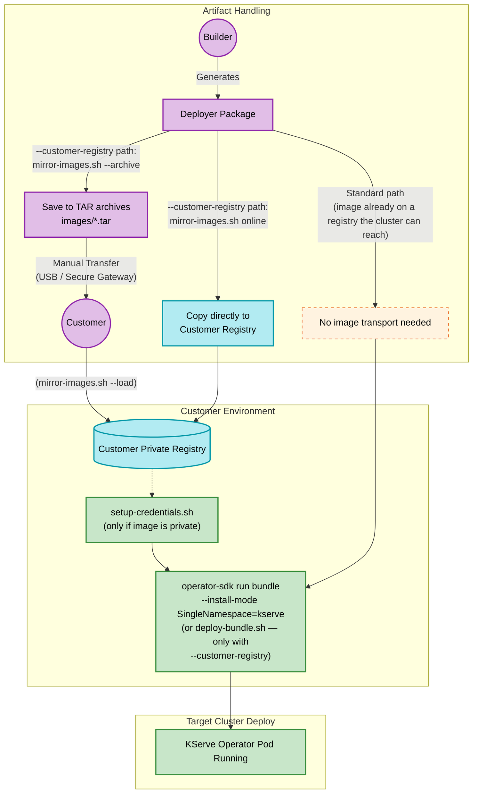

# KServe Operator — Visual Architecture Overview

This document provides a high-level, conceptual look at the KServe Operator generation and deployment lifecycle. It is designed to be easily readable and breaks down the system into three distinct phases: **The Build Factory**, **The Deployer Journey**, and **The Operator Brain**.

---

## Phase 1: The Build Factory (Generation)

This diagram illustrates how the shell scripts ingest upstream KServe manifests and transform them into distributable artifacts.

```mermaid
graph LR
  classDef source fill:#f9d0c4,stroke:#e92758,stroke-width:2px,color:#000
  classDef engine fill:#ffe6a7,stroke:#ff9f1c,stroke-width:2px,color:#000
  classDef output fill:#d4e157,stroke:#689f38,stroke-width:2px,color:#000
  classDef package fill:#bbdefb,stroke:#1976d2,stroke-width:2px,color:#000
  classDef helper fill:#eceff1,stroke:#607d8b,stroke-width:1px,stroke-dasharray: 4 4,color:#000

  subgraph Source [1. Upstream Source]
    Upstream[(KServe GitHub\nMaster Branch)]:::source
  end

  subgraph Engine [2. Processing Pipeline]
    RawExtract[[generate-kserve-raw.sh\n(Extracts & Patches)]]:::engine
    OpGen[[generate-kserve-operator.sh\n(Scaffolds Operator)]]:::engine
  end

  subgraph Artifacts [3. Output Deliverables]
    Bundle[(OLM Bundle\nContainer Image)]:::output
    OpImage[(Operator\nContainer Image)]:::output
    Package{Customer\nDeployer Package}:::package
  end
  
  subgraph CustomerPkg [Inside Deployer Package]
    direction TB
    Scripts[Helper Scripts:<br/>• setup-credentials.sh (always)<br/>• enable-ingress.sh (always)<br/>• mirror-images.sh (--customer-registry)<br/>• deploy-bundle.sh (--customer-registry)]:::helper
  end

  Upstream --> RawExtract
  RawExtract -.->|Base Raw Manifests| OpGen
  OpGen -->|make bundle| Bundle
  OpGen -->|docker buildx| OpImage
  OpGen -->|kustomize| Package
  
  Package -.- CustomerPkg
```

---

## Phase 2: The Deployer Journey

This illustrates how the generated deliverables travel from the builder to the target customer environment, covering the **standard** path (public/private registry, no image transport) and the **air-gapped customer-registry** path (images shipped as tarballs, requires the `--customer-registry` generator flag).



---

## Phase 3: The Operator Brain (Auto-Init & Reconciliation)

Once installed on the cluster, the Operator runs autonomously. This state diagram shows the internal logic of the operator as it boots up and installs KServe.

```mermaid
stateDiagram-v2
    classDef default fill:#fafafa,stroke:#333,stroke-width:1px
    classDef applying fill:#e1f5fe,stroke:#0288d1,stroke-width:2px
    classDef ready fill:#e8f5e9,stroke:#2e7d32,stroke-width:2px,font-weight:bold
    classDef trigger fill:#fff3e0,stroke:#ff9800,stroke-width:2px,font-style:italic
    
    [*] --> OperatorStartup
    OperatorStartup --> AutoInitPhase : Manager Starts
    
    state AutoInitPhase {
        direction LR
        CreateCR: Auto-create default KServeRawMode CR
        WatchTrigger: Operator watches for CR creation
        CreateCR --> WatchTrigger
    }
    
    AutoInitPhase --> ReconciliationLoop : Triggers Watch Event
    
    state ReconciliationLoop {
        step1: 1. Validate cert-manager (pre-flight CRD check)
        step2: 2. Apply KServe CRDs
        step3: 3. Apply RBAC & Namespaces
        step4: 4. Apply KServe Controller
        step5: Poll Wait for Webhooks to stabilise
        step6: 5. Apply Serving Runtimes
        
        step1 --> step2:::applying
        step2 --> step3:::applying
        step3 --> step4:::applying
        step4 --> step5:::applying
        step5 --> step6:::applying
    }
    
    ReconciliationLoop --> KServeOperational:::ready
    KServeOperational --> SteadyStateWatch
    
    SteadyStateWatch --> [*] : KServe Ready for InferenceServices
```

---

## Phase 4: Actor Sequence Diagram (End-to-End Execution)

This sequence diagram details the chronological interaction between the Builders, Customers, Scripts, and Kubernetes.

```mermaid
sequenceDiagram
    autonumber
    actor Builder
    participant Script as Generator Scripts
    participant RegBuild as Builder Registry
    actor Customer
    participant RegCust as Customer Registry
    participant K8s as Target Cluster
    participant Operator as KServe Operator

    Builder->>Script: Run generate-kserve-raw.sh
    Script-->>Builder: Raw manifests (p-kserve-raw/)
    Builder->>Script: Run generate-kserve-operator.sh
    Script->>RegBuild: Push base operator & bundle
    Script-->>Builder: Standalone package (p-kserve-operator-package/)
    
    Builder-->>Customer: Hand over package (Archive or Direct Transfer)

    note over Customer,K8s: --customer-registry path only:
    Customer->>RegCust: Run mirror-images.sh (Copy images via skopeo)
    Customer->>K8s: Run setup-credentials.sh (only if image is private)

    note over Customer,K8s: Standard path (or after the above):
    Customer->>K8s: kubectl create namespace kserve + kserve-operator-system
    Customer->>K8s: operator-sdk run bundle --install-mode SingleNamespace=kserve
    note over K8s: --install-mode auto-creates the OperatorGroup;<br/>no manual yaml needed

    K8s->>RegCust: Pull Operator & Bundle Images
    K8s-->>Operator: Start Controller Pod
    
    Operator->>K8s: Auto-create default KServeRawMode CR
    Operator->>K8s: Reconcile (Validate cert-manager pre-flight, Apply CRDs, RBAC, Controller, Runtimes)
    K8s-->>Customer: KServe Stack is Operational!
```

---

## Phase 5: Flow Diagram (Manifest Transformation Data Pipeline)

This flowchart highlights the inner workings behind how the original KServe YAML files are modified, compiled into Go code, and shipped in the Docker image.

```mermaid
flowchart LR
    classDef file fill:#fff8e1,stroke:#ffa000,stroke-width:2px,color:#000
    classDef process fill:#e1f5fe,stroke:#0288d1,stroke-width:2px,color:#000
    classDef active fill:#e8f5e9,stroke:#388e3c,stroke-width:2px,color:#000

    GH[Upstream KServe<br/>kserve-master/]:::file -- generate-kserve-raw.sh --> Extractor[Kustomize Build<br/>+ Python ConfigMap patch]:::process
    Extractor -- "Removes Istio/Knative ingress<br/>(disableIstioVirtualHost: true,<br/>disableIngressCreation: true)" --> Raw[Raw YAMLs]:::file
    Raw -- "Sets defaultDeploymentMode:<br/>RawDeployment" --> PatchedRaw[Functional Raw Manifests<br/>02-kserve-crds, 03-rbac,<br/>04-core, 05-runtimes]:::file

    PatchedRaw -- "Copied to assets/ + embedded<br/>via go:embed (apply.go.tmpl)" --> GoCode[Operator Binary<br/>with embedded manifests]:::process
    GoCode -- "Apply-time YAML rewrite:<br/>kserve namespace refs → req.Namespace" --> Bin[Runtime Application]:::file
    Bin -- Containerized --> Img[Operator Linux Docker Image]:::active
```



---

## End-to-End Test Validation

Verified on a fresh Docker Desktop Kubernetes cluster, covering both the default-namespace path and a custom-namespace install (Design C). Full per-test details and bug findings live in [test-report-customer-registry.md](test-report-customer-registry.md).

### Default `kserve` namespace

| Step | Command | Result |
|------|---------|--------|
| Pre-flight | (cert-manager + OLM installed once per cluster) | ✅ |
| Extract manifests | `./generate-kserve-raw.sh -t p-kserve-raw` | ✅ 4 manifest dirs (02–05) + 06-sample-model |
| Generate operator | `./generate-kserve-operator.sh ... -b -p -o` | ✅ Operator project + OLM bundle built and pushed |
| Create namespaces | `kubectl create namespace kserve` + `kserve-operator-system` | ✅ |
| Deploy bundle | `operator-sdk run bundle <bundle-image> --namespace kserve-operator-system --install-mode SingleNamespace=kserve` | ✅ CSV `Succeeded`; OperatorGroup auto-created |
| Watch KServe install | `kubectl get kserverawmode -A -w` | ✅ CR auto-created in `kserve`; phase `Ready` in ~44s |
| Test inference | `curl .../sklearn-iris:predict` | ✅ `{"predictions":[1]}` |

### Custom `my-kserve` namespace

| Step | Command | Result |
|------|---------|--------|
| Create namespaces | `kubectl create namespace my-kserve` + `kserve-operator-system` | ✅ |
| Deploy bundle | `operator-sdk run bundle <bundle-image> --namespace kserve-operator-system --install-mode SingleNamespace=my-kserve` | ✅ |
| CR auto-created in `my-kserve`; KServe runtime installed in `my-kserve` (apply-time YAML rewrite) | `kubectl get kserverawmode -A` | ✅ Ready in ~40s |
| All baked `kserve` refs rewritten | RoleBinding subjects, WebhookConfiguration `service.namespace`, Certificate `dnsNames`, `cert-manager.io/inject-ca-from` annotation | ✅ all → `my-kserve` |
| Test inference | `curl .../sklearn-iris:predict` | ✅ `{"predictions":[1]}` |

### Customer-registry path (air-gapped)

| Step | Command |
|------|---------|
| Generate with customer registry | `./generate-kserve-operator.sh ... --customer-registry docker.io/<customer> -b -p -o` |
| Archive images on builder | `bash mirror-images.sh --archive` → `images/operator.tar` + `images/bundle.tar` |
| Transfer to customer site | (USB / secure gateway) |
| Load images on customer side | `bash mirror-images.sh --load --user <u> --pass <t>` |
| Set up pull secrets | `bash setup-credentials.sh --user <u> --pass <t>` |
| Deploy | `bash deploy-bundle.sh dockerhub-creds` (or `KSERVE_NS=my-kserve bash deploy-bundle.sh dockerhub-creds`) |

### Cleanup

| Step | Command |
|------|---------|
| Tear down operator | `operator-sdk cleanup p-kserve-operator -n kserve-operator-system` |
| Remove namespaces | `kubectl delete ns my-kserve kserve-operator-system` |
| Clean generated dirs | `./generate-kserve-operator.sh -c p-kserve-operator` |
